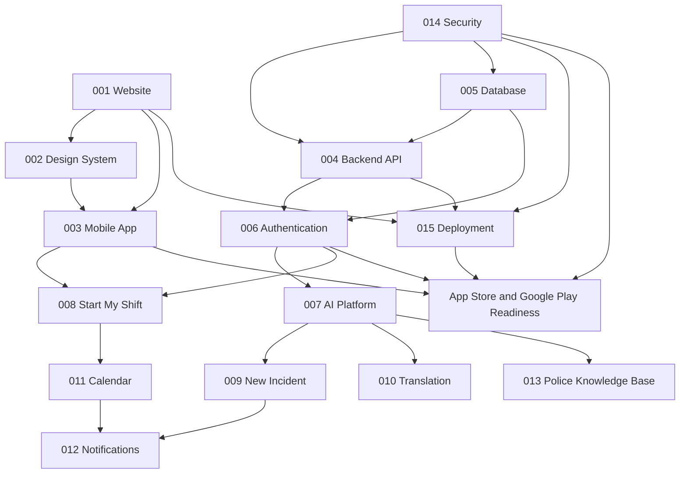

# OPAi Dependency Map

Status: Sprint 001 setup
Product posture: Testing / pre-launch

## Build Order Summary

OPAi should be built in layers. Public-facing trust and brand work comes first, followed by reusable design rules, then app foundations, then backend and database foundations, then authentication, AI, police workflows, security hardening, and deployment readiness.

## Milestones

### Milestone 1: Public Website and Brand Foundation

Projects:
- Project 001 - Website

Why it comes first:
- Establishes public identity, approved language, disclaimers, launch posture, PTSD awareness tone, and Canadian police officer positioning.
- Creates the source of truth for app-store links, privacy policy, terms, and contact information.

Exit criteria:
- Website pages are complete.
- Testing/pre-launch language is accurate.
- Privacy policy and terms exist.
- Website passes lint, typecheck, and build.
- Deployment path is ready for review.

### Milestone 2: Mobile App UI Foundation

Projects:
- Project 002 - Design System
- Project 003 - Mobile App

Why it follows the website:
- The mobile app should inherit brand, color, typography, icon, accessibility, and disclaimer rules from the public website.
- Design system work prevents inconsistent screens and expensive redesign later.

Exit criteria:
- Design tokens are documented.
- Mobile navigation shell is stable.
- iPhone and iPad layouts are visually reviewed.
- Store screenshots can be produced from consistent UI.

### Milestone 3: Backend and Database Foundation

Projects:
- Project 004 - Backend API
- Project 005 - Database

Why it follows UI foundation:
- Once core product workflows are defined visually, backend resources and database models can be built around real screens and user tasks.

Exit criteria:
- FastAPI service foundation exists.
- PostgreSQL migrations exist.
- Health checks, validation, and configuration are in place.
- API/database tests pass.

### Milestone 4: Authentication and User Accounts

Projects:
- Project 006 - Authentication

Why it follows backend and database:
- Secure accounts require stable API and persistence layers.

Exit criteria:
- Email/password login is implemented.
- Password reset and account recovery are implemented.
- Secure sessions are implemented.
- Biometric login is integrated on mobile using platform mechanisms.
- Optional two-factor authentication is designed or implemented as approved.

### Milestone 5: AI Platform

Projects:
- Project 007 - AI Platform

Why it follows authentication:
- AI requests may include sensitive user workflow data and must be tied to authenticated users, consent, audit logging, and privacy controls.

Exit criteria:
- OpenAI Responses API integration exists.
- Assistant routing exists.
- Police-context disclaimers and safeguards exist.
- Conversation context is stored or minimized according to policy.

### Milestone 6: Core Police Modules

Projects:
- Project 008 - Start My Shift
- Project 009 - New Incident
- Project 010 - Translation
- Project 011 - Calendar
- Project 012 - Notifications
- Project 013 - Police Knowledge Base

Why these wait:
- These modules depend on design, mobile foundation, backend, database, authentication, AI routing, and security.

Recommended order inside Milestone 6:
1. Project 008 - Start My Shift
2. Project 009 - New Incident
3. Project 010 - Translation
4. Project 011 - Calendar
5. Project 012 - Notifications
6. Project 013 - Police Knowledge Base

Reasoning:
- Start My Shift is mostly supportive reminder UI and establishes the non-mandatory operational tone.
- New Incident is data-heavy and should follow basic app structure.
- Translation uses permissions and AI/provider integrations.
- Calendar creates structured time-based data.
- Notifications depend on calendar and reminder data.
- Knowledge base depends on AI, source policy, and data governance.

Exit criteria:
- Each module has UI, API, data model, tests, disclaimers, and privacy review.

### Milestone 7: Security, Testing, and Deployment

Projects:
- Project 014 - Security
- Project 015 - Deployment

Why it spans all work:
- Security and deployment are cross-cutting. They should start early as architecture but become final gates after product features are testable.

Exit criteria:
- CI/CD is active.
- Secrets are not committed.
- Staging and production are separated.
- Security controls and audit logging are implemented.
- Release checklist exists.

### Milestone 8: App Store / Google Play Readiness

Projects:
- Project 003 plus Projects 006-015 as required

Why it comes last:
- Store submission depends on product stability, privacy information, screenshots, disclaimers, test credentials, support URLs, and production infrastructure.

Exit criteria:
- Store metadata complete.
- Privacy policy URL present.
- Screenshots meet Apple and Google requirements.
- Build is tested.
- Review notes are complete.
- No user-facing copy implies unsupported claims.

## Project Dependency Table

| Project | Depends On | Blocks |
| --- | --- | --- |
| 001 - Website | Brand requirements | Public launch, policies, store support URLs |
| 002 - Design System | 001 | 003 and consistent future UI |
| 003 - Mobile App | 001, 002 | 006-013 mobile surfaces and store readiness |
| 004 - Backend API | 005, 014 architecture | 006-013 production behavior |
| 005 - Database | 004 architecture, 014 policy | 004, 006-013 |
| 006 - Authentication | 004, 005, 014 | 007-013 personalized workflows |
| 007 - AI Platform | 004, 005, 006, 014 | 009, 010, 013 AI-assisted features |
| 008 - Start My Shift | 002, 003, 004, 005, 006, 011, 014 | 012 reminders |
| 009 - New Incident | 002-007, 014 | Reports, evidence, follow-ups |
| 010 - Translation | 002-007, 014 | Translation workflows and history |
| 011 - Calendar | 004-006, 008, 014 | 012 notifications |
| 012 - Notifications | 003-006, 011, 014 | High-priority reminders |
| 013 - Police Knowledge Base | 004-007, 014 | Knowledge search and AI grounding |
| 014 - Security | Applies to all | Production readiness |
| 015 - Deployment | 001, 004-014 as available | Release automation |

## Critical Path

## Sprint 001 Boundary

Sprint 001 should only execute Project 001 website foundation work. The other projects may be referenced as roadmap content, but they should not be implemented as product functionality during this sprint.
